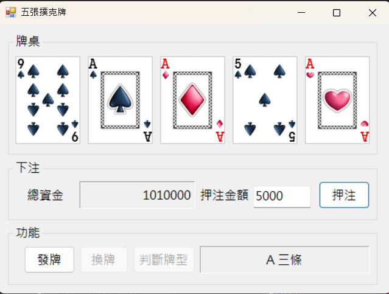

# 撲克牌試算遊戲 (Poker Hand Ranker)1133334楊恩奇

## 遊戲特色
這是一個基於 C# WinForms 開發的撲克牌遊戲，模擬了電子撲克（Video Poker）的玩法。玩家可以發牌、選擇換牌，系統會根據最終牌型計算獎金，並動態更新玩家擁有的籌碼總額。

**完整的發牌機制**：內建 52 張牌洗牌演算法，確保發牌隨機性。

**換牌系統**：點擊牌面可選擇「保留」或「換牌」，模擬真實電子撲克邏輯。

**智慧牌型判斷**：自動分析「點數出現次數」與「花色規律」，判定從「一對」到「同花大順」等 9 種牌型。

**籌碼增減系統**：

**下注**：透過 textBox1 輸入金額。

**計算**：依據不同牌型的賠率自動翻倍獎金。

**更新**：即時更新 label1 中的總籌碼餘額。

## 牌型賠率表

| 牌型 | 賠率 | 說明 |
|-----------|-----------------|----------------|
| 同花大順 | 250x | 同花色的 10, J, Q, K, A |
| 同花順 | 50x | 同花色且數字連續 |
| 鐵支 | 25x | 四張點數相同 |
| 葫蘆 | 9x | 三條 + 一對 |
| 同花 | 6x | 五張花色全部相同 |
| 順子 | 4x | 五張數字連續 |
| 三條 | 3x | 三張點數相同 |
| 兩對 | 2x | 兩組點數相同的對子 |
| 一對 | 1x | 一組點數相同的對子 |

## 開發者測試模式 (Cheat Codes)

程式內建了 KeyBoard Hook 功能。在發牌後（換牌前），按下鍵盤特定按鍵可直接變更為特定牌型：

**Q**：觸發 同花大順

**W**：觸發 同花順

**E**：觸發 同花

**R**：觸發 鐵支

**T**：觸發 葫蘆

**Y**：觸發 三條

## 程式核心架構

1. **InitializePoker**：動態產生 PictureBox 陣列，並建立事件連結。

2.**Shuffle (洗牌)**：使用 Random 進行 1000 次元素交換，打亂 0~51 編號。

3.**btnCheck_Click (核心邏輯)**：統計花色 (colorCount) 與點數 (pointCount)。使用布林邏輯（如 isFlush, isRoyal）進行複合判斷。進行 int.TryParse 安全數值轉換，確保金額運算不崩潰。

4.**Pic_Click**：透過控制 Tag 屬性（"back"/"front"）切換牌面顯示狀態

## 如何執行
1.使用 Visual Studio 開啟專案檔。

2.確保 Properties.Resources 中包含名為 back 及 pic1 ~ pic52 的圖片資源。

3.按下 F5 執行。

4.在文字框輸入籌碼，點擊「發牌」開始遊戲！

## Screenshots

